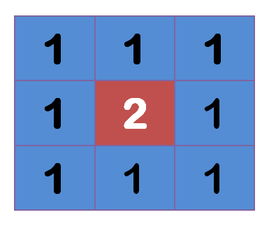
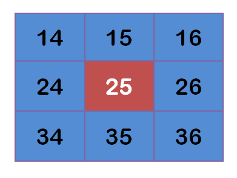
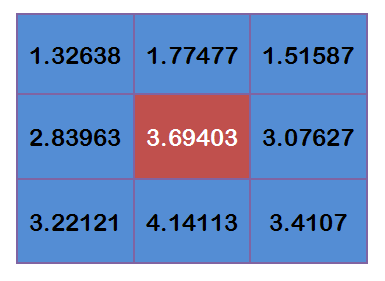

## 安装networkX遇到的一些问题
#### centos7安装Python3，处理自带Python2兼容问题
- alternatives --install /bin/python python /usr/local/python 2 最后一个数字代表优先级，数字越大优先级越高
- alternatives --display python 查看当前安装的Python版本，状态
- python - status is auto.说明当前状态为auto(centos7默认状态),还有一个状态是manual。
- alternatives --auto python 把python状态修改为auto，在这个状态下，默认选择使用优先级高的程序。这样把Python3的优先级设置的高于Python2的优先级，平常使用Python3，当遇到必须使用Python2的程序(yum)，并不会转到Python2.
- alternatives这个命令并不能神奇的对不同的命令执行不同的程序版本。这个命令存在的意义，就是为了方便管理，查看所有版本，能够通过一条命令(--config)修改程序版本，省去了修改文件的麻烦。
- --install之后，默认的模式是auto，一旦做出任意修改模式状态会变为manual,通过--auto来修改manual状态为auto.这就是只有--auto选项的原因。
- 还有一个问题：yum只支持python2，需要修改#!/usr/bin/python 才能在运行的时候区分python3和python2.
- which yum #查看yum文件位置
- vi /bin/yum     #打开可执行文件
- 修改#!/usr/bin/python 为#!/usr/bin/python2 ,保存修改，在次执行yum的时候，就不会报语法错误了。
- alternatives真是个有意思的东西，--config配置python3之后，不管你问就是否修改，都不行，但是--auto之后，就可以起作用了，可见--config是有强制作用的，只要出现python的地方，不管你是否选用了某一版本，直接强制使用配置的版本。
- 要安装networkX需要先安装python-pip.
- 直接使用yum install python-pip时会报错，显示No package python-pip available.没有python-pip软件包可以安装。为了能够安装这些包，需要先安装扩展源epel.
- #yum -y install epel-release #-y 的意思，是在后续安装过程中，需要问我们是否同意的时候，一致回答yes.
- #yum -y install python-pip #现在就可以安装python-pip了。
- 利用pip安装networkX，但是在安装networkX之前需要安装矩阵处理包numpy和图形绘制包matplotlib.安装命令如下：
- #pip install numpy
- #pip install matplotlib    #在centos7下执行安装会报错error:command 'gcc' failed with exit status 1
- 缺少一些模块(libffi-devel python-devel openssl-devel)，执行安装之后就可以了
- #yum install gcc libffi-devel python-devel openssl-devel
- #pip install networkx
- 到头来发现networkx并不支持Python3，还是要用回Python2.
- import matplotlib.pyplot as plt 时报错，显示ImportError:No module named Tkinter.
- #yum -y install tkinter  #之后tkinter模块安装完毕，就不会出现之前的错误了。
- 另外networkX目前只支持python2，并不支持python3,当前的时间是2017-06-21.
#### python2 -m pip install community
```javascript
#python2 -m pip install community
import community
import networkx as nx
G=nx.Graph()
part=community.best_partition(G)
AttributeError:'module' object has no attribute 'best_partition'
#python2 -m pip install python-louvain
execution succeed
#python2 -m pip install python-igraph
configure:error: no C++ compiler found or it connot create executables
Could not download and compile the C core of igraph
#yum install gcc-c++
#yum install igraph-devel
#python2 -m pip install python-igraph
execution succeed
note:dnf is fedora's yum
import tushare as ts
industry=ts.get_industry_classified()
industry.to_csv(datadir)
UnicodeEncodeError:'ascii' codec can't encode characters in position 0-3:ordinal not in range(128)
Solution:
import sys
reload(sys)
sys.setdefaultencoding('utf-8')
execution succeed.
```
#### python忽略warning警告错误
- 在编写文件时：
```javascript
import warnings
warnings.filterwarnings("ignore")
```
- 在执行时：
- python -W ignore yourscript.py
#### networkx基本技巧
```javascript
import networkx as nx     #导入networkx
G=nx.Graph()              #Create an empty undirect graph G
G=nx.DiGraph()            #Create an empty direct grahp G
G.add_node(1)             #Add node 1
G.add_nodes_from([3,4,5]) #Add nodes from a set
G.add_edge(1,3)           #Add an edge
G.add_edges_from([(3,5),(3,6),(6,7)])   #Add edges from a set
nx.draw(G)                              #Draw graph G
nx.draw(G,with_labels=True)             #Draw graph G with labels
nx.draw(G,node_color='y',with_labels=True,node_size=800)   #Graph attributes,node_color='y' means node color is yellow.
plt.show()                              #Show graph G
``` 
#### 使用Python写爬虫下载股票数据
- Python爬虫程序需要用到两个包pandas和tushare。
- 其实主要是为了安装tushare包，但是如果直接安装tushare包会报错，因为存在对pandas包的依赖，另外还需要bs4包，beautiful soup 是Python的一个库，主要功能是从网页抓取数据。
- tushare是一个免费、开源的Python财经数据接口包。主要实现对股票等金融数据从数据采集、清洗加工到数据存储的过程。考虑到Python pandas包在金融量化分析中体现出的优势，tushare返回的绝大部分数据格式都是pandas dataframe类型，非常便于用pandas/numpy/matplotlib进行数据分析和可视化。
- scipy函数库在numpy库的基础上增加了众多的数学、科学以及工程计算中常用的库函数。例如线性代数、常微分方程数值求解、信号处理、图像处理、稀疏矩阵等等。
```javascript
#pip install pandas     #注意使用root权限，不然会报错
#pip install beautifulsoup4        #安装beautiful soup包
#pip install html5lib   #顺带安装这个解析器，并不是必须的。
#pip install tushare
#pip install scipy     #安装scipy包
```
- 处理csv文件时，像000100这种数据，用excel打开时显示100，前面多出的000被省略掉了，其实数据一直在，用代码读取的时候还是000100，值得注意。
- ls =l |wc -l #统计当前目录下文件数量
- python代码注意缩进，特别是有:的下一行，即便是注释也要缩进，不然报错。
- range(start,end,scan) #计数从start开始，到end结束，但不包括end。scan每次跳跃的间距。
- 在进行文件处理时，注意把文件关闭，不然会产生临时文件，报错。
#### matplotlib.pyplot使用。
```javascript
import matplotlib.pyplot as plt
plt.figure()    #Create a new figure.Notes: If you are creating many figures, make sure you explicitly call "close" on the figures you are not using,because this will enable pylab to properly clean up the memory.
plt.draw()      #Redraw the current figure.
plt.close()     #Close a figure window. And memory recovery.
plt.plot(x,y)   #plot x and y using default line style and color.
plt.axis('off') #Turns off the axis lines and labels
```
- 在执行程序时，通过top命令查看内存利用率平稳之后，证明内存回收成功。
- 使用ssim时需要用到skimage包
- #pip install scikit-image
- #yum install opencv*     #安装opencv，import cv2 不会报错了。
```javascript
import cv2
sift=cv2.SIFT()     #创建sift对象失败，报错
#AttributeError:'module' object has no attaibute 'SIFT'
#pip install opencv_contrib_python
sift=cv2.xfeatures2d.SIFT_create()     #问题解决
kp=sift.detect(gray,None)       #返回一个包含一系列keypoint(关键点)的list
print(type(kp),type(kp[0]))     #kp属于list类型，kp[0]属于cv2.KeyPoint类型
print(kp[0].pt)                 #返回KeyPoint(关键点)kp[0]的坐标pt
des=sift.compute(gray,kp)       #返回一个描述符元组tuple
print(type(des),type(des[0]),des[0])  #des属于tuple类型，des[0]属于list类型，内容是一系列的<KeyPoint 0x304a2d0>
print(type(des[1]),des[1])      #des[1]属于多维数组numpy.ndarray类型，The output matrix of descriptors.每一维多是对一个keypoint的描述。
print(des[1].shape)             #Tuple of array dimensions.返回元组每一维的大小，shape属性list并没有。
bf=cv2.BFMatcher()              #BF和FLANN是opencv二维特征点匹配常见的两种方法，分别对应BFMatcher和FlannBasedMatcher.
#BFMatcher总是尝试所有可能的匹配，从而使得他总能够找到最佳匹配。FlannBasedMatcher是一种近似法，算法更快但是找到的是最近邻近似匹配，当我们需要一个相对好的匹配但是不需要最佳匹配的时候可以使用FlannBasedMatcher.
matches=bf.knnMatch(des1,des2,k=2) #knnMatch(queryDescriptors,trainDescriptors,k) trainDescriptors-dataset of descriptors furnished by user(用户提供的描述符数据集),k-number of the closest descriptors to be returned for every input query(每个输入查询返回的最接近的描述符数).
kp,des=sift.detectAndCompute(gray,None)
des=sift.compute(gray,kp)
kp,des=sift.compute(gray,kp) #这两种形式都可以，前一个返回矩阵，后面返回两个list
```
- L1 norm就是绝对值相加，又称曼哈顿距离，L2 norm就是欧几里得距离。
- FlannBsdrfMatcher,need to pass two dictionaries which specifies the algorithm to be used,its related parameters etc.First one is IndexParams.As a summary, for algorithms like SIFT you can pass following:
- index_params=dict(algorithm=FLANN_INDEX_KDTREE,trees=5)
- Second dictionary is the SearchParams.It specifies the number of times the trees in the index should be recursively traversed.Higher values gives better precidion,but also takes more time.If you want to change the value,pass search_params=dict(checks=100)
```javacript
FLANN_INDEX_KDTREE=0
index_params=dict(algorithm=FLANN_INDEX_KDTREE,trees=5)
search_params=dict(checks=50)
flann=cv2.FlannBasedMatcher(index_params,search_params)
```
- FAST Features from Accelerated Segment Test
- BRIEF Binary Robust Independent Elementary Features
- SURF Speeded-Up Robust Features
- SIFT Scale-Invariant Feature Transform
- ORB算法最大的特点就是计算速度快。首先得益于使用FAST检测特征点，FAST的检测速度正如它的名字一样是出了名的快。再次是使用BRIEF算法计算描述子，该描述子特有的2进制串的表现形式不仅节约了存储空间，而且大大缩短了匹配的时间。
- SIFT特征采用了128维的特征描述子，由于描述子用的浮点数，所以它将会占用512bytes的空间。对于SURF特征，常见的是64维的描述子，它也将占用256bytes的空间。占用的空间越大，意味着匹配的时间越长。
- 图像的特征点可以简单的理解为图像中比较显著的点，如轮廓点，较暗区域中的亮点，较亮区域中的暗点等。
- 得到特征点后我们需要以某种方式描述这些特征点的属性。这些属性的输出我们称之为该特征点的描述子(Feature Descriptors).
- DoG Difference of Gaussian(Gaussian distribution高斯分布，既常说的正态分布)
- LoG Laplacian of Gaussian
- Relative entropy(相对熵) Kullback-Leibler divergence,KL距离
- 当两幅图像的SIFT特征向量生成后，采用关键点特征向量的欧氏距离来作为两幅图像中关键点的相似性判定度量。
- 哈希感知算法：一种是基本的均值哈希感知算法，一种是余弦变换哈希感知算法(pHash).
- 哈希感知算法基本原理如下：
- 把图片转化成一个可识别的字符串，这个字符串也叫哈希值。
- 和其他图片匹配字符串。
#### 高斯模糊算法(高斯卷积 高斯核)
- 模糊算法有很多种，其一是“高斯模糊”(Gaussian Blur)。它将正态分布(又叫“高斯分布”)用于图像处理。
- 高斯模糊算法，本质上是一种数据平滑技术。
- 所谓模糊，可以理解成每一个像素都取周边像素的平均值。  

- 上图中，2是中间点，周边点都是1.  

- "中间点"取"周围点"的平均值，就会变成1.在数值上，这是一种"平滑化"。在图形上，就相当于产生"模糊"效果，"中间点"失去细节。
- 计算平均值时，取值范围越大，"模糊效果"越强烈。
- 既然每个点都要取周边像素的平均值，那么应该如何分配权重呢？
- 如果使用简单平均，显然不是很合理，因为图像都是连续的，越靠近的点关系越密切，越远离的点关系越疏远。因此，加权平均更合理，距离越近的点权重越大，距离越远的点权重越小。
- 正态分布的权重，正态分布显然是一种可取的权重分配模式。  

- 在图形上，正态分布是一种钟形曲线，越接近中心，取值越大，越远离中心，取值越小。
- 计算平均值的时候，我们只需要将“中心点”作为原点，其他点按照其在正态曲线上的位置，分配权重，就可以得到一个加权平均值。
- 二维正态分布图像。  

- 正态分布的密度函数叫做"高斯函数"(Gaussoin function).它的一维形式是：  

- 其中，μ是x的均值，σ是x的方差。因为计算平均值的时候，中心点就是原点，所以μ等于0。  

- 根据一维高斯函数，可以推导得到二维高斯函数：  

- 根据这个函数计算每个点的权重，预设一个σ，把坐标代入函数，就可以得到该点的权重。
- 计算权重矩阵，假定中心点的坐标是（0,0），那么距离它最近的8个点的坐标如下：  

- 更远的点以此类推。
- 为了计算权重矩阵，需要设定σ的值。假定σ=1.5，则模糊半径为1的权重矩阵如下：  

- 这9个点的权重总和等于0.4787147，如果只计算这9个点的加权平均，还必须让它们的权重之和等于1，因此上面9个值还要分别除以0.4787147，得到最终的权重矩阵.  

- 有了权重矩阵，就可以计算高斯模糊的值了。假设现有9个像素点，灰度值（0-255）如下：  

- 每个点乘以自己的权重值：  

- 得到  

- 将这9个值加起来，就是中心点的高斯模糊的值。
- 对所有点重复这个过程，就得到了高斯模糊后的图像。如果原图是彩色图片，可以对RGB三个通道分别做高斯模糊。
