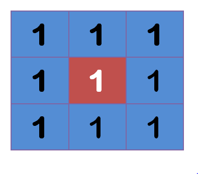
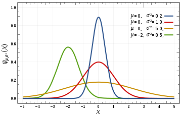
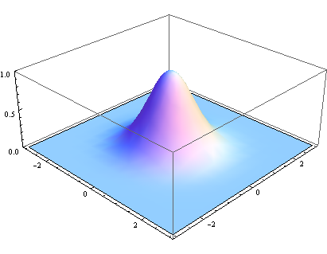
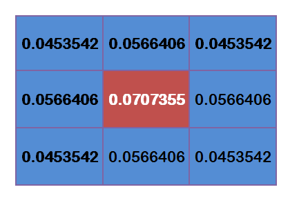
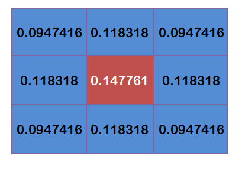

#### Gaussion Blur (高斯模糊)
- 高斯模糊算法(高斯卷积 高斯核)
- 模糊算法有很多种，其一是“高斯模糊”(Gaussian Blur)。它将正态分布(又叫“高斯分布”)用于图像处理。
- 高斯模糊算法，本质上是一种数据平滑技术。
- 所谓模糊，可以理解成每一个像素都取周边像素的平均值。  

- 上图中，2是中间点，周边点都是1.  

- "中间点"取"周围点"的平均值，就会变成1.在数值上，这是一种"平滑化"。在图形上，就相当于产生"模糊"效果，"中间点"失去细节。
- 计算平均值时，取值范围越大，"模糊效果"越强烈。
- 既然每个点都要取周边像素的平均值，那么应该如何分配权重呢？
- 如果使用简单平均，显然不是很合理，因为图像都是连续的，越靠近的点关系越密切，越远离的点关系越疏远。因此，加权平均更合理，距离越近的点权重越大，距离越远的点权重越小。
- 正态分布的权重，正态分布显然是一种可取的权重分配模式。  

- 在图形上，正态分布是一种钟形曲线，越接近中心，取值越大，越远离中心，取值越小。
- 计算平均值的时候，我们只需要将“中心点”作为原点，其他点按照其在正态曲线上的位置，分配权重，就可以得到一个加权平均值。
- 二维正态分布图像。  

- 正态分布的密度函数叫做"高斯函数"(Gaussoin function).它的一维形式是：  

- 其中，μ是x的均值，σ是x的方差。因为计算平均值的时候，中心点就是原点，所以μ等于0。  

- 根据一维高斯函数，可以推导得到二维高斯函数：  

- 根据这个函数计算每个点的权重，预设一个σ，把坐标代入函数，就可以得到该点的权重。
- 计算权重矩阵，假定中心点的坐标是（0,0），那么距离它最近的8个点的坐标如下：  

- 更远的点以此类推。
- 为了计算权重矩阵，需要设定σ的值。假定σ=1.5，则模糊半径为1的权重矩阵如下：  

- 这9个点的权重总和等于0.4787147，如果只计算这9个点的加权平均，还必须让它们的权重之和等于1，因此上面9个值还要分别除以0.4787147，得到最终的权重矩阵.  

- 有了权重矩阵，就可以计算高斯模糊的值了。假设现有9个像素点，灰度值（0-255）如下：  

- 每个点乘以自己的权重值：  

- 得到  

- 将这9个值加起来，就是中心点的高斯模糊的值。
- 对所有点重复这个过程，就得到了高斯模糊后的图像。如果原图是彩色图片，可以对RGB三个通道分别做高斯模糊。